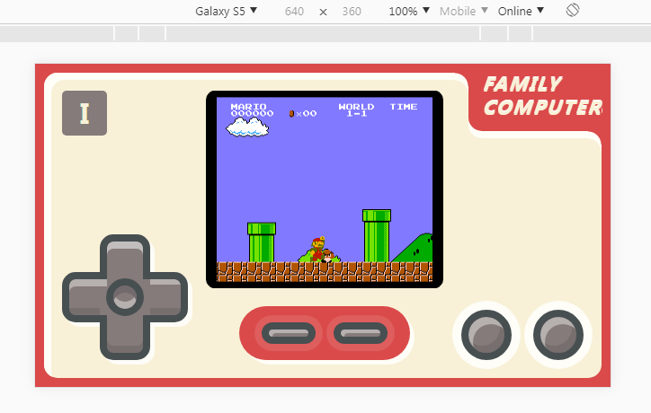

# NintendoNes
a NintendoNes monitor for web based on [jsnes](https://github.com/bfirsh/jsnes)

two styles for PC and mobile phone.

## experience

open link

[https://web.codelabo.cn/NintendoNes/](https://web.codelabo.cn/NintendoNes/)

or

scan QRcode

## screeshot

**PC**

**mobile-portrait**

**mobile-landscape**

## key Map for PC

**player 1**

|PC|Nes|desc|
|---|---|---|
|`W`|`BUTTON_UP`|move up|
|`S`|`BUTTON_DOWN`|move down|
|`A`|`BUTTON_LEFT`|move left|
|`D`|`BUTTON_RIGHT`|move right|
|`I`,`J`|`BUTTON_B`|attack|
|`K`,`O`|`BUTTON_A`|jump|
|`Tab`|`BUTTON_SELECT`|select model|
|`Enter`|`BUTTON_START`|start or pause|
